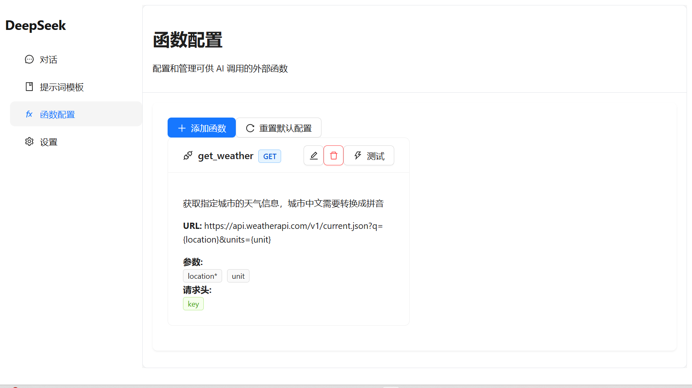
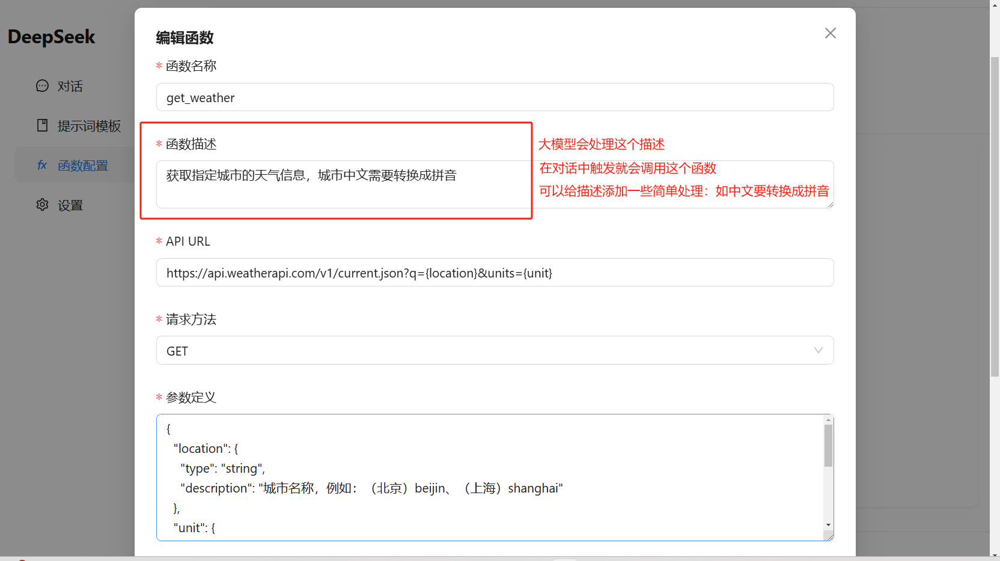
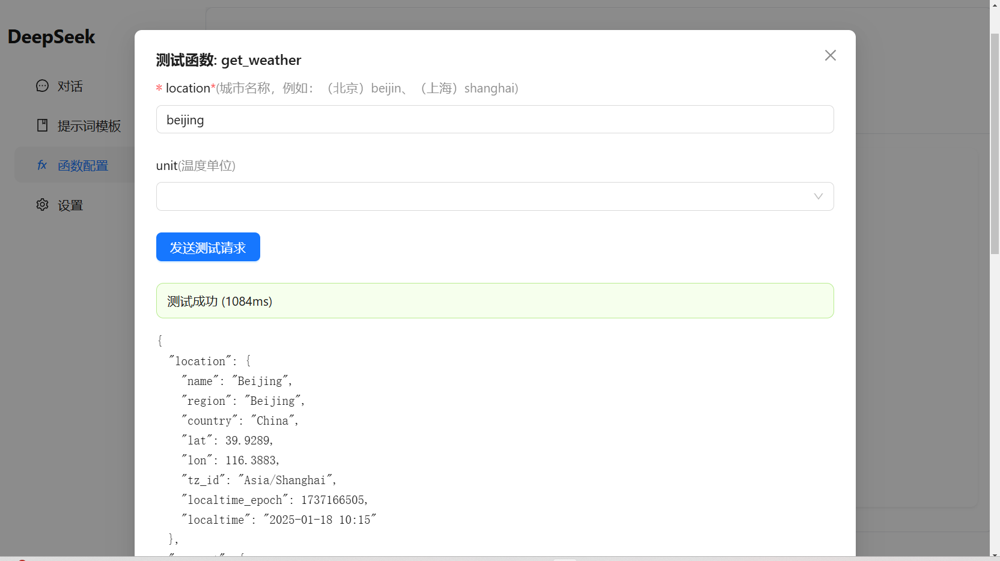
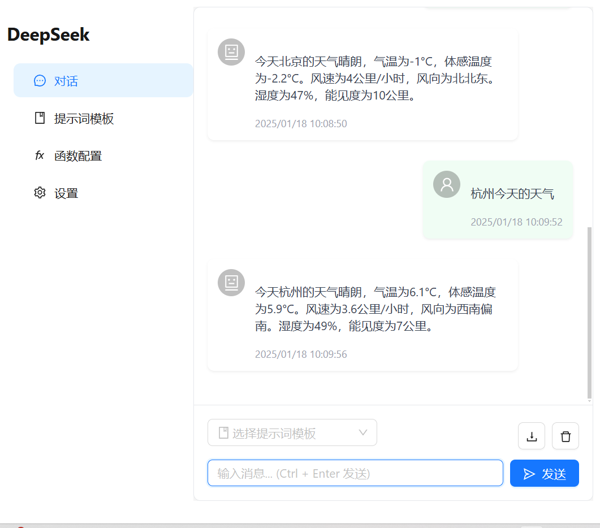

# DeepSeek WebUI

DeepSeek WebUI 是一个基于 DeepSeek 大语言模型的现代化 Web 交互界面。

[支持国产，从我做起，在线体验link](https://deepseek-webui.vercel.app/)

本项目完全开源，欢迎共建

## 主要功能

### 函数调用功能
- 支持自定义外部函数配置
- 内置常用 API 函数模板（天气、搜索、翻译等）
- 函数参数可视化配置
- 支持函数测试功能
- 支持 GET/POST 请求方法
- 支持自定义请求头
- 支持参数验证和必填项设置

#### 函数调用示例
*函数配置示例*

*天气查询函数配置示例*

*天气查询函数测试调用示例*


### 对话功能
- 支持多轮对话
- 支持代码高亮显示
- 支持 Markdown 渲染
- 支持数学公式渲染
- 支持多会话管理
- 支持对话历史导出/导入

*对话功能示例*


### 模型控制
- 支持温度（temperature）调节
- 支持采样策略选择（top_p, top_k）
- 支持最大输出长度控制
- 支持系统提示词（System Prompt）自定义
- 支持多个模型切换（Chat, Coder）


### 高级功能
- 提示词（Prompt）模板库
- API 密钥管理
- 函数配置管理
- 对话历史管理

## 技术栈

- Next.js 14 (App Router)
- TypeScript
- Tailwind CSS
- Zustand (状态管理)
- Ant Design (UI 组件)
- localStorage (本地数据存储)

## 快速开始

### 本地开发

1. 克隆项目
```
bash
git clone https://github.com/yourusername/deepseek-webui.git
cd deepseek-webui
```
2. 安装依赖
```
bash
npm install
```
3. 启动开发环境
```
bash
npm run dev
```
4. 访问项目
```
http://localhost:3000
```
### 生产构建
```
bash
npm run build
```

## Vercel 部署

1. Fork 本项目到你的 GitHub 账号

2. 在 [Vercel](https://vercel.com) 注册账号并连接你的 GitHub

3. 点击 "New Project" 导入本项目

4. 点击 "Deploy" 开始部署

5. 部署完成后，Vercel 会自动生成一个域名供访问

## 使用说明

1. 首次使用需要在设置页面配置 API Key
2. 可以在函数配置页面添加或修改可调用的外部函数
3. 在对话页面可以直接与 AI 进行对话，AI 会根据需要调用配置的函数

## 技术栈

- Next.js 14 (App Router)
- TypeScript
- Tailwind CSS
- Zustand (状态管理)
- Ant Design (UI 组件)
- localStorage (本地数据存储)


## ⭐️Star 经历

## Star History

看到这里，请你点个免费的小小的star，谢谢！
[](https://star-history.com/#LazyBoyJgn99/deepseek-webui&Date)
